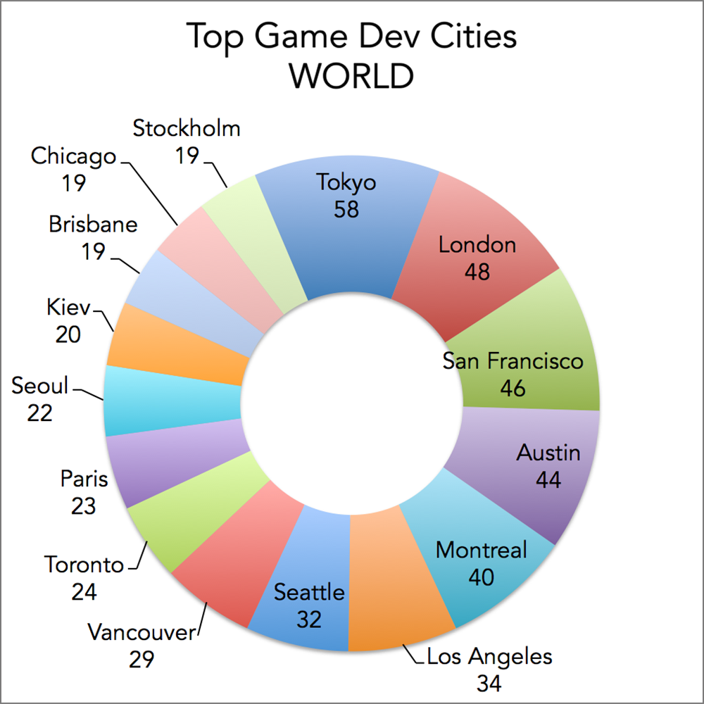

# Office

**Priorities by order:**

- Developers like to be near successful tech startups that have raised at least 1 Million dollars.
- Designers like to go to design talks and share knowledge. There must be some nearby companies that also do design.
- 30% of the company have at least 1 child.
- Executives like Starbucks A LOT. Ensure there's a starbucks not to far.
- Account managers need to travel a lot
- All people in the company have between 25 and 40 years, give them some place to go to party.
- The CEO is Vegan
- If you want to make the maintenance guy happy, a basketball stadium must be around 10 Km.
- The office dog "Pepe" needs a hairdresser every month. Ensure there's one not too far away.
