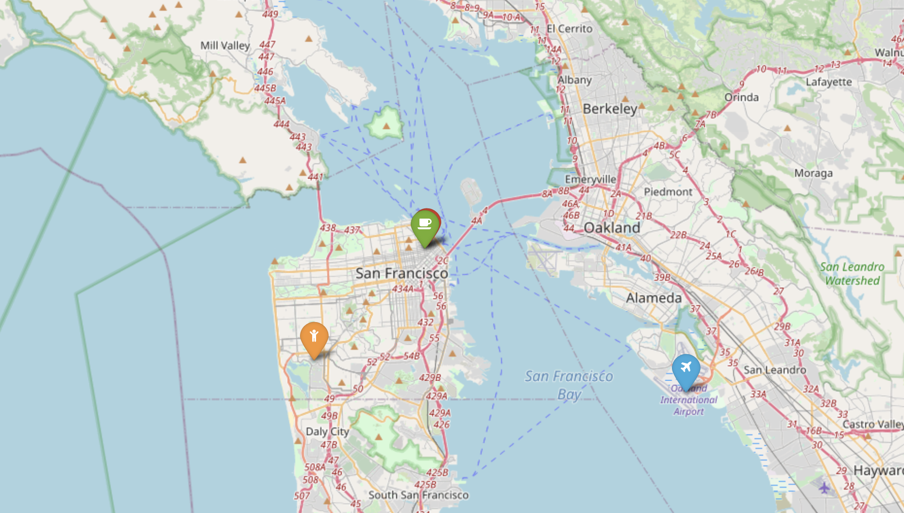

# Office

**Project Aims:** Find a location for the offices of a new Gaming company in the best place for the company to grow. The place must cover all the following requirements:
- Developers like to be near successful tech startups that have raised at least 1 Million dollars.   
- Executives like Starbucks A LOT. Ensure there's a starbucks not to far.    
- Account managers need to travel a lot. 
- 30% of the company have at least 1 child.
  
### The City: 
**Top Game Development Cities:**  
58 - Tokyo  
48 - London   
46 - San Francisco  
44 - Austin   
40 - Montreal   
34 - Los Angeles  
32 - Seattle  
29 - Vancouver  
24 - Toronto  
23 - Paris  
22 - Seoul  
20 - Kiev  
19 - Brisbane  
19 - Chicago  
19 - Stockholm 
  
This project takes on an initial dataset of offices. Such dataset contains much more data for some countries than others.   
Taking this into account, **California** was chosen as the location for the office because there was a lot of data available and it is one of the top game development cities
  
### The Requirements - Google API:   
  
Though the Google Places API, I was able to find the latitude a longitude of the different requirements. By using the *FindDistances* function, the distance of the closest one was found for each office in the dataset. 
  
### The  Final Decision:
**PicApp: ( 37.794020, -122.403124)**

 
